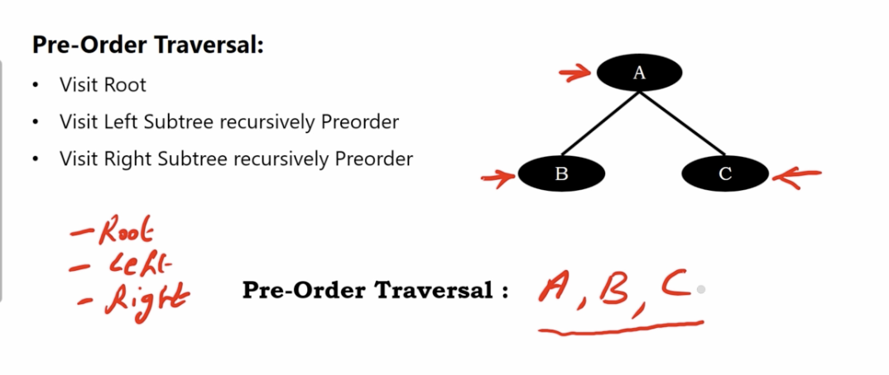
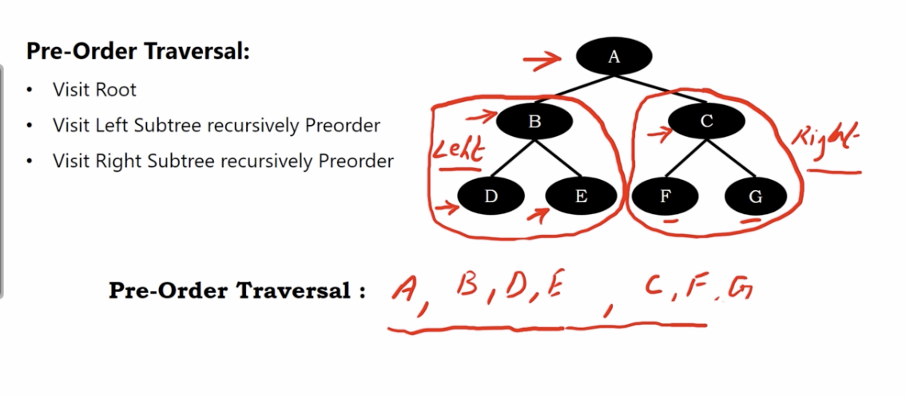
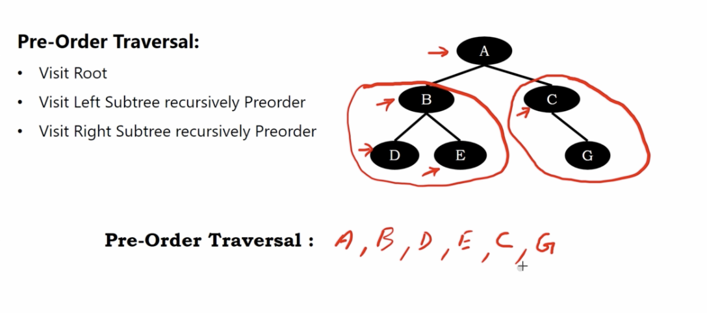
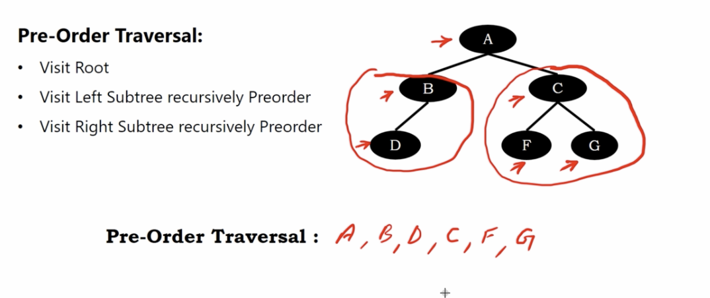

# binary tree preorder traversal

1. visit root
2. visit left subtree recursively preorder
3. visit right subtree recursively preorder

# Example 1

</img>

# Example 2

</img>

# Example 3

</img>

# Example 4

</img>
