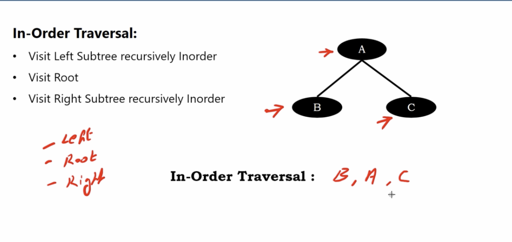
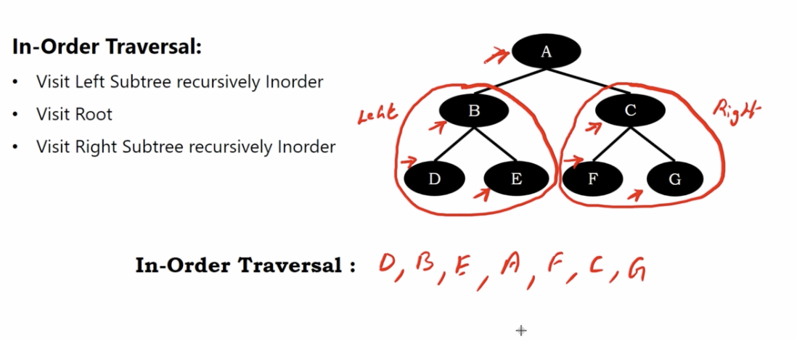
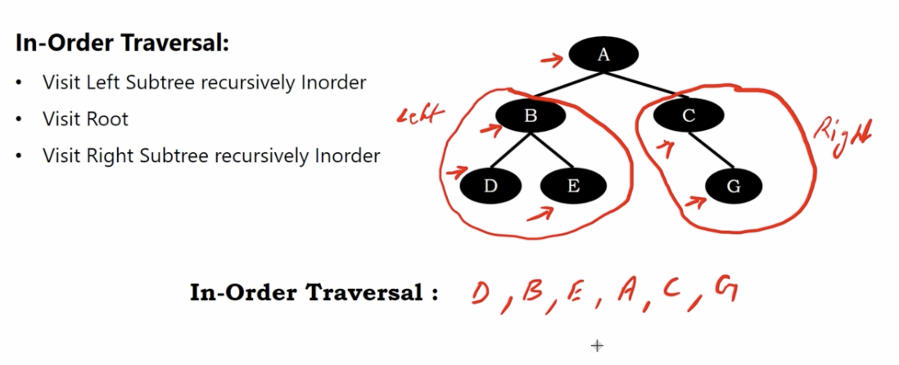
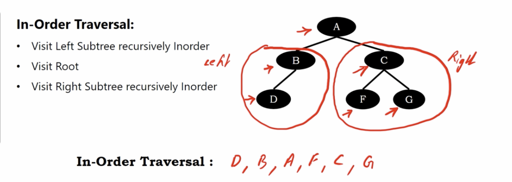

# binary tree inorder traversal

1. visit left subtree recursively inorder
2. visit root 
3. visit right subtree recursively inorder

# Example 1

</img>

# Example 2

</img>

# Example 3

</img>

# Example 4

</img>
