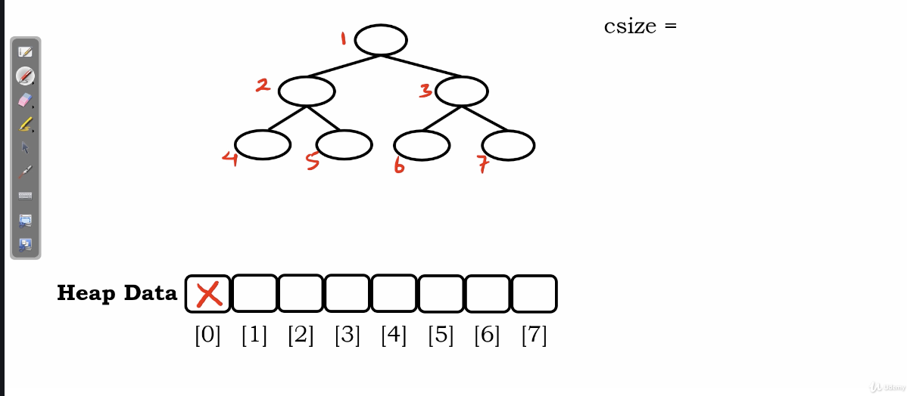
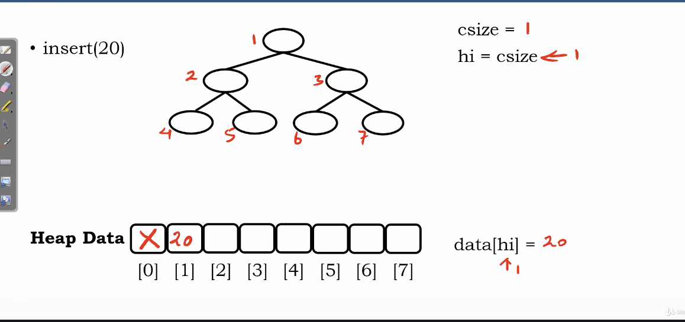
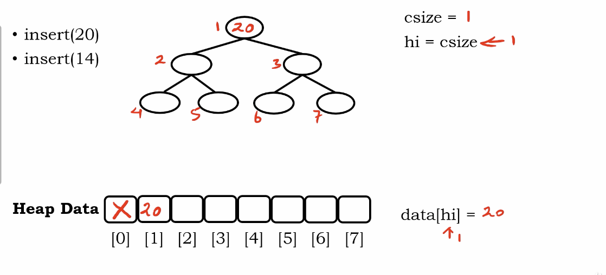
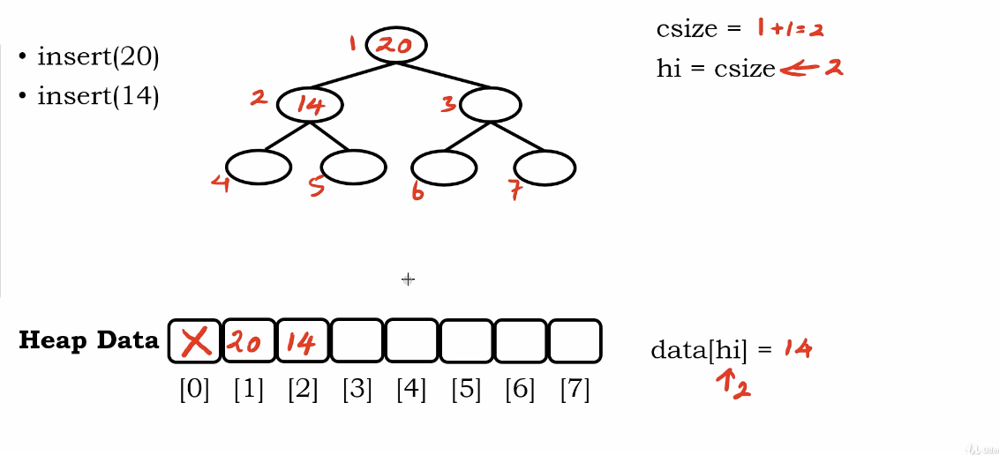
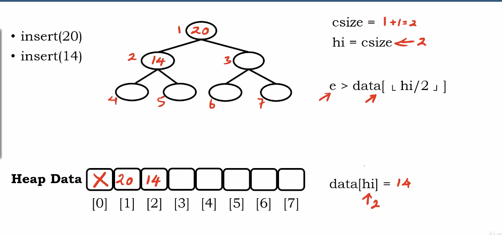
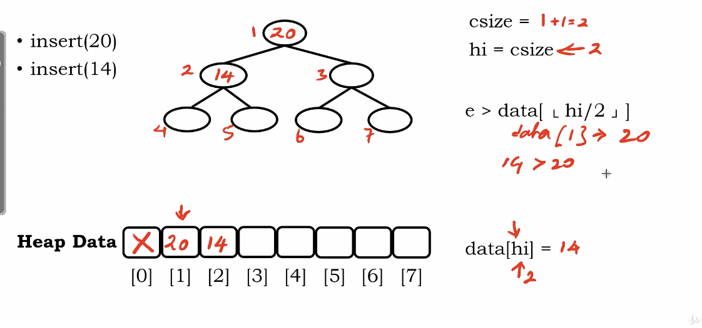

# Heap Insertion Algorithm

</img>

we'll consider using array-based data structure to represent a binary tree.

the index 0 : we won't put anything here.

</img>

csize : current size

hi : heap index

</img>

is it match relational property?

</img>

``` Python
e > data[ floor[hi / 2] ]
# current value > its parent?
```

under array representation, the parent always be the floor(children / 2)

</img>

</img>

TBD
