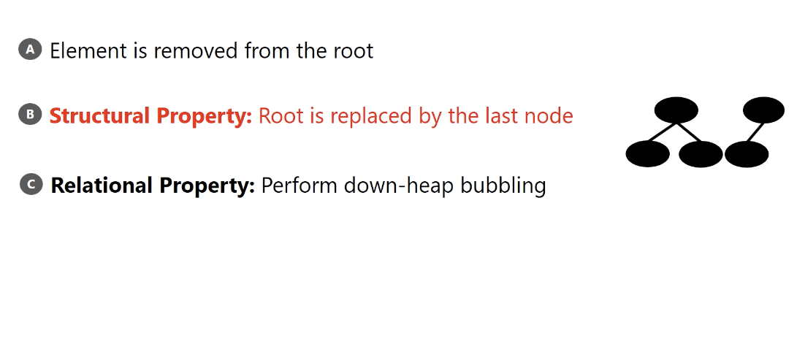
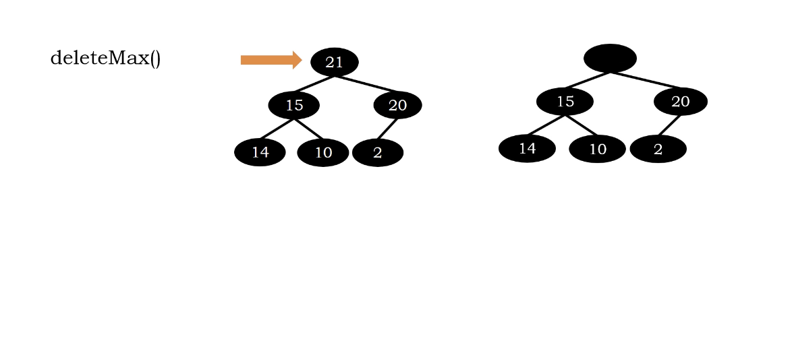
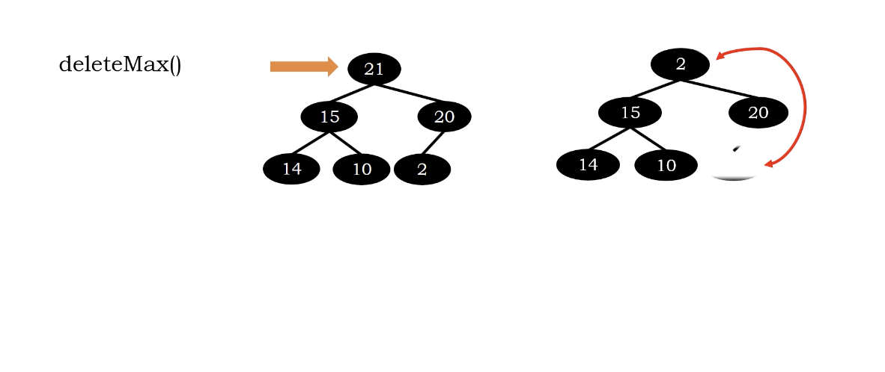
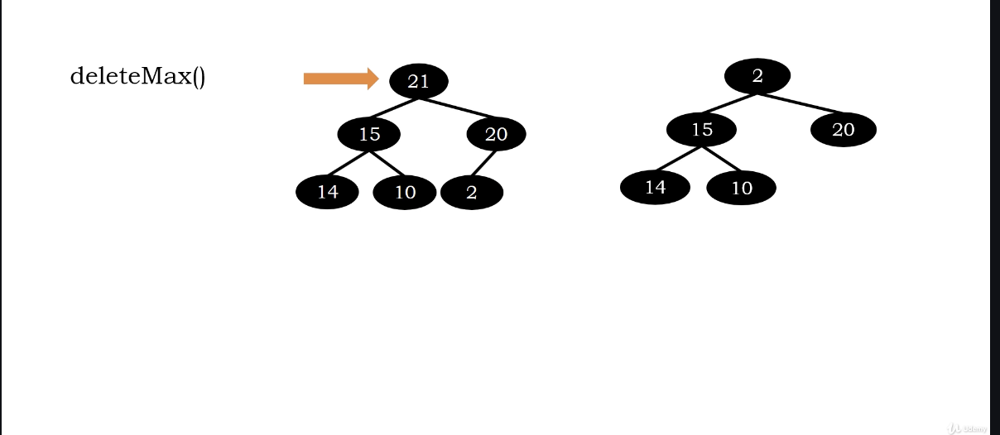
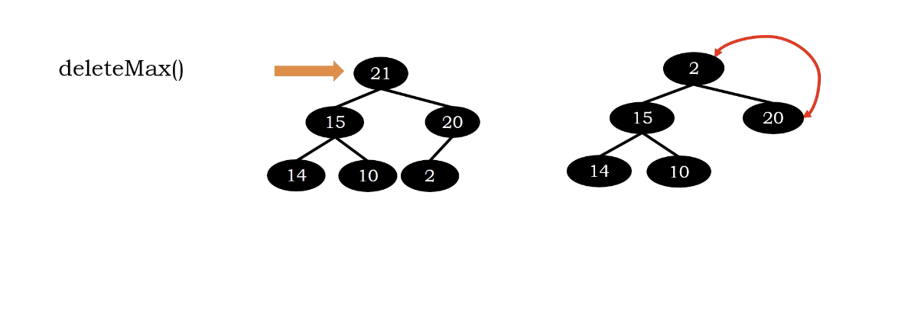
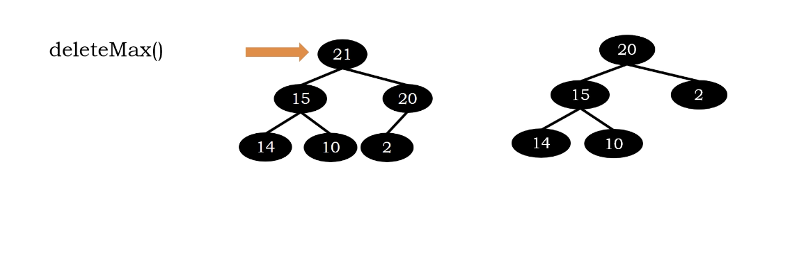
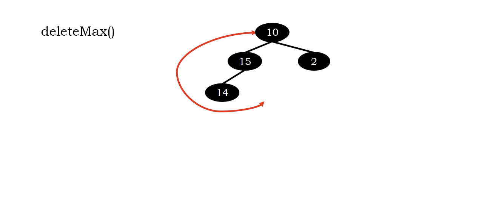
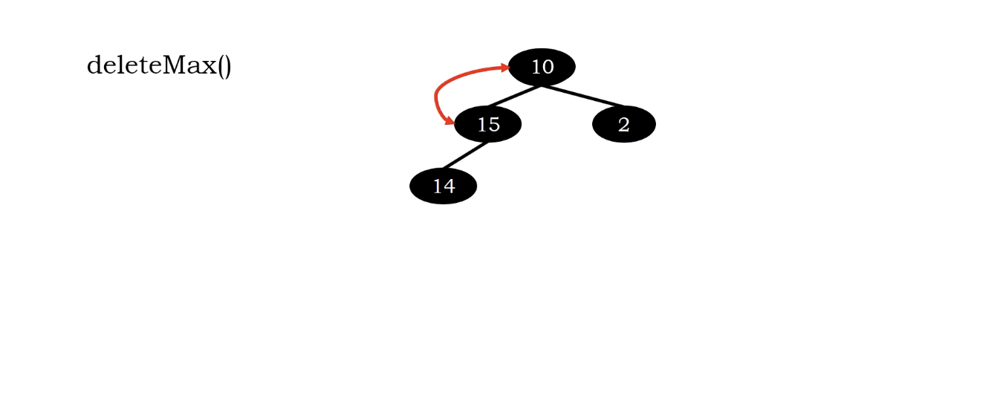
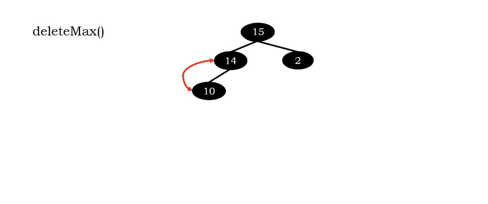

# Heap Deletion

we cannot remove anything we want, we need to make sure our heap still

1. a complete binary tree.(replace by the last node)
2. follow relational property(we need perform down-heap bubbling)

</img>

# Example

</img>
</img>
</img>

You might think why we replace the root as 20, complete?

Maybe it's a harder algorithm to design, we start from simplest.
</img>
</img>

# Another Example

</img>
</img>
</img>
</img>

# Time Complexity

replace : $O(1)$
down-heap-bubbling : $O(log n)$
