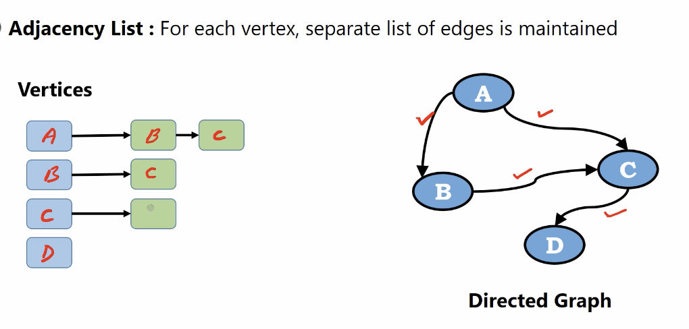
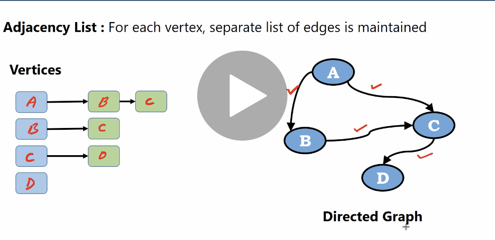
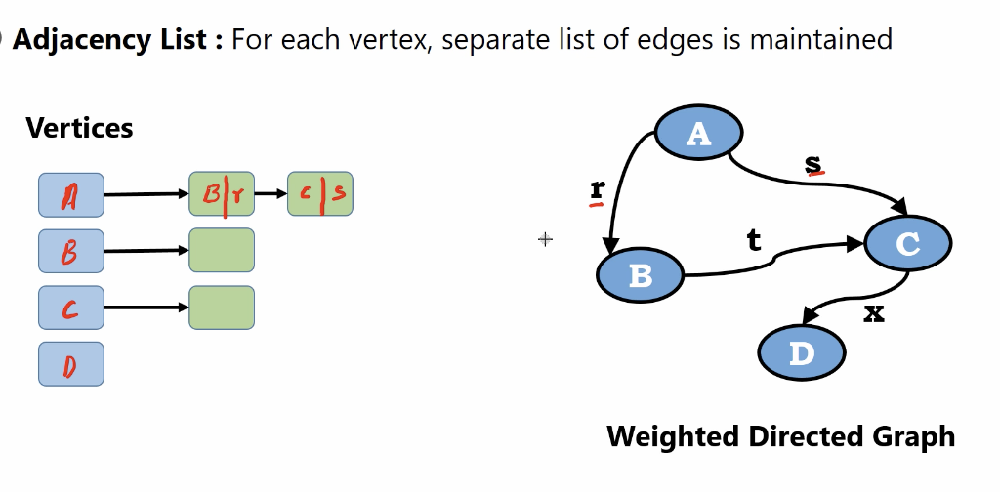
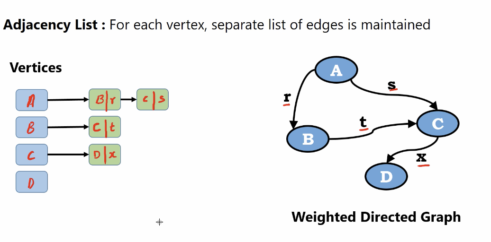
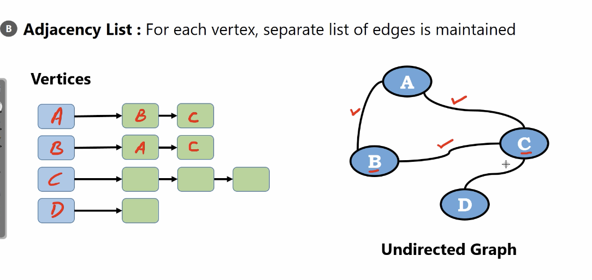
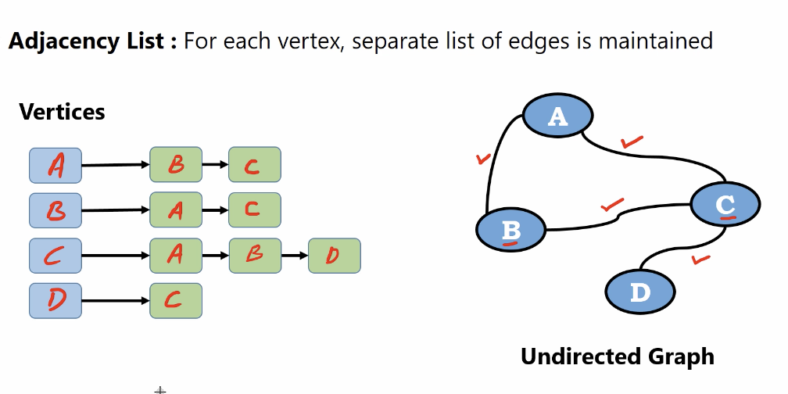
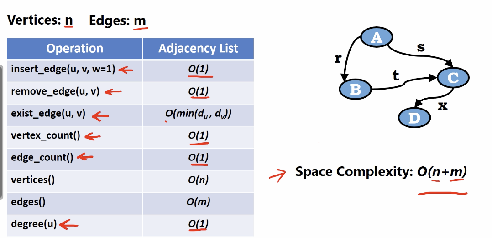

# adjancency list

## Directed Graph

For each vertex, seprarated list of edges is maintained

</img>
</img>
</img>

vertices point the connecting vertex.

## Weighted Directed Graph

</img>

store the vetex and the weights accordingly.

</img>

# Undirected Graph

</img>

The is a connection between $B$ and $A$. So they have the reference to each other.

</img>

# Performance

the exist_edge : $d_u$ means degree of the vetex $u$

</img>
