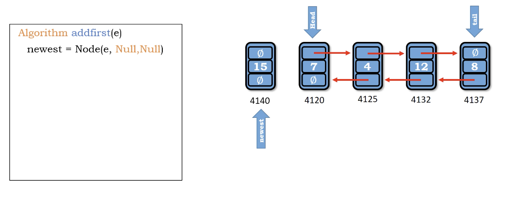
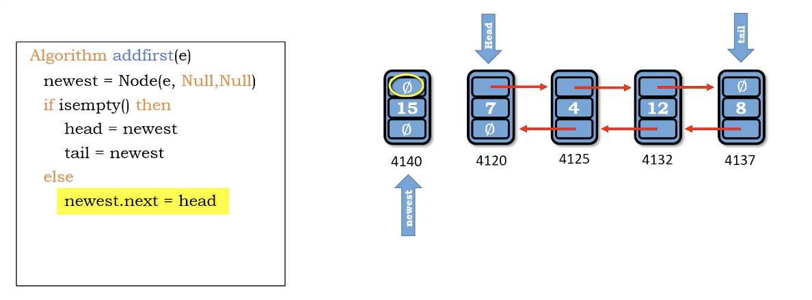
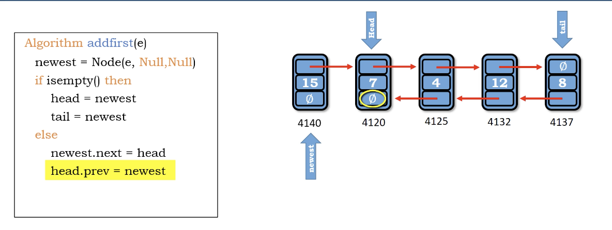

# add first in double linked list

</img>
</img>
</img>

``` Python
Algorithm add_first(e)
    newest = Node(e, Null, Null)
    if is_empty() then
        head = newest
        tail = newest
    else
        newest.next = head
        head.prev = newest # double link
        head = newest
    size += 1
```

Time : $O(1)$

Space : $O(1)$
