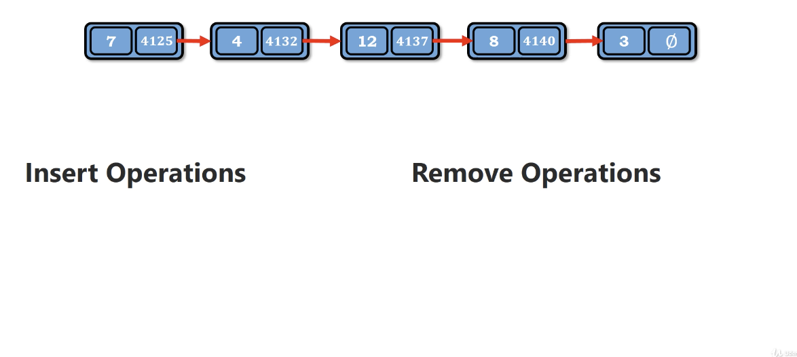
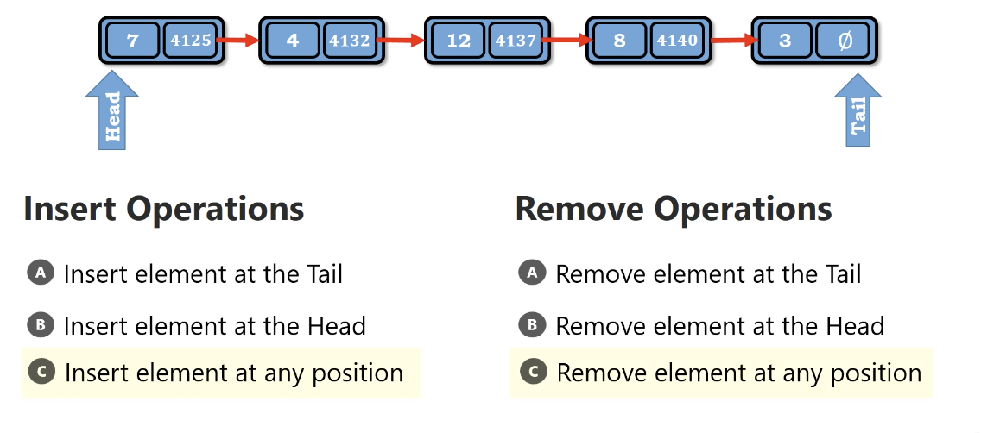
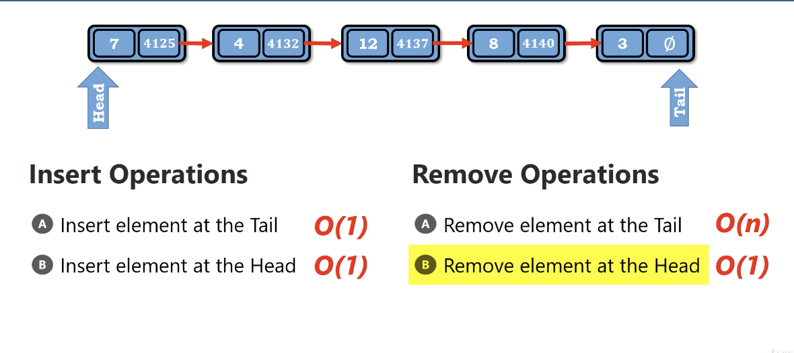
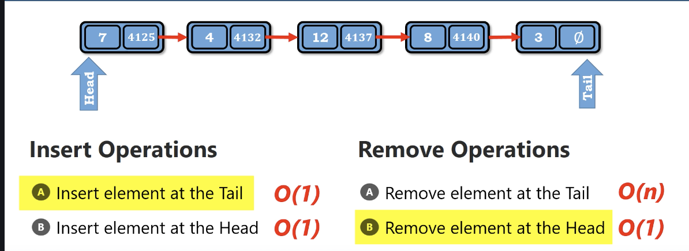
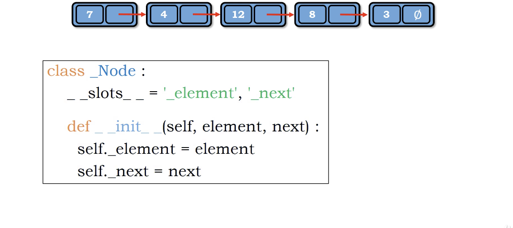
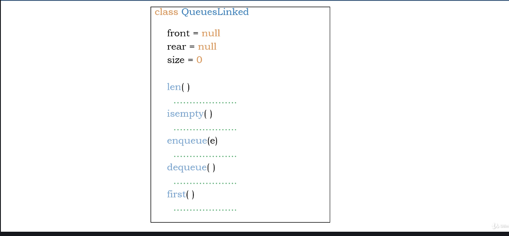
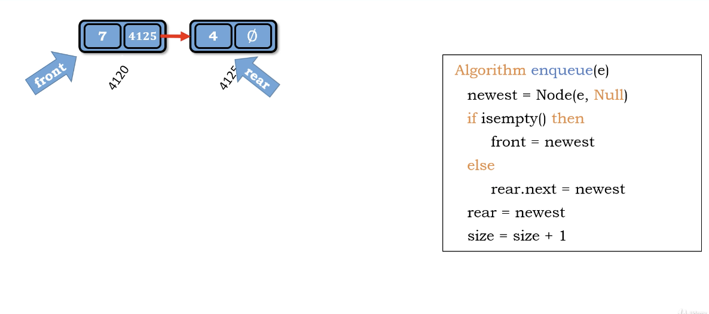
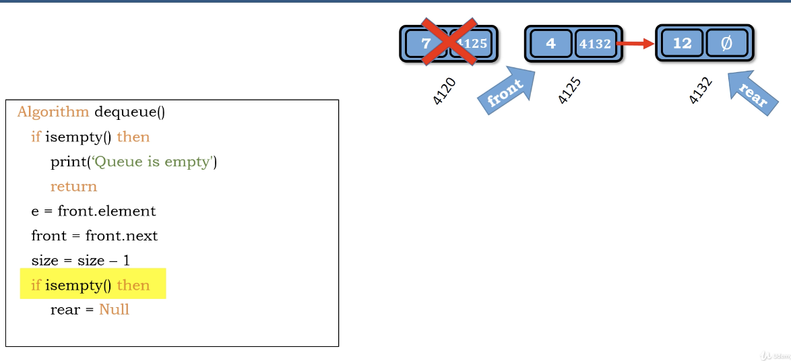
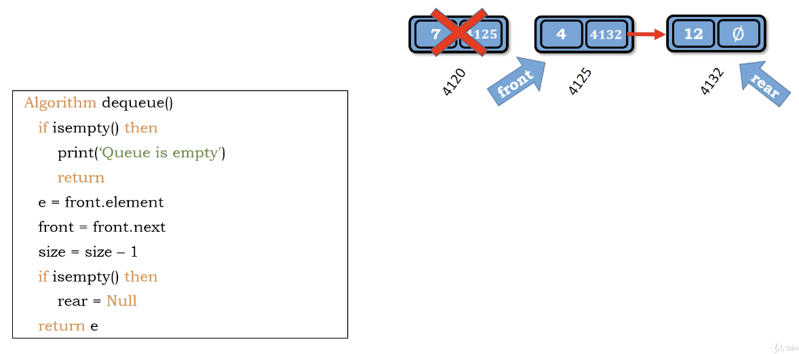
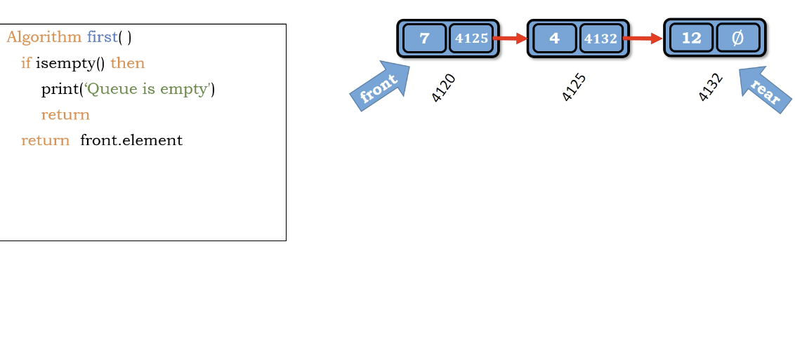

# Queue

</img>
</img>
</img>
</img>

* use linked-list to implement a queue is perfect =)

# Hints of implement

</img>
</img>

enqueue : add node and link it to rare

</img>

dequeue : remove node and return value

we don't have to delete anything in python. python do the garbage collection work automatically.

</img>
</img>

first

</img>
